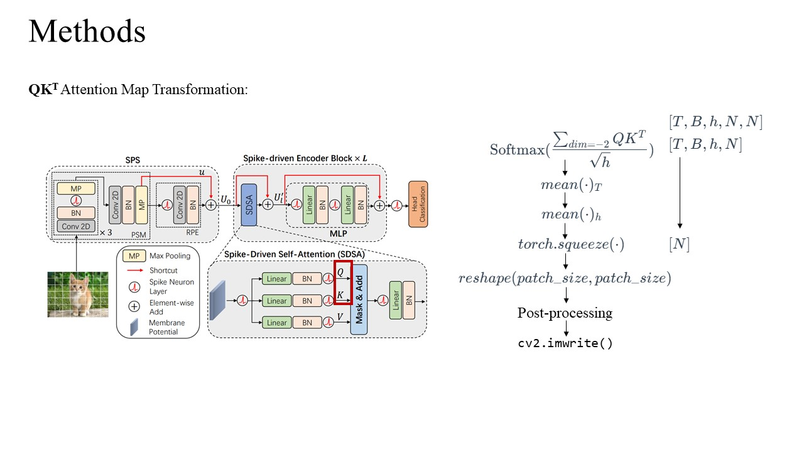
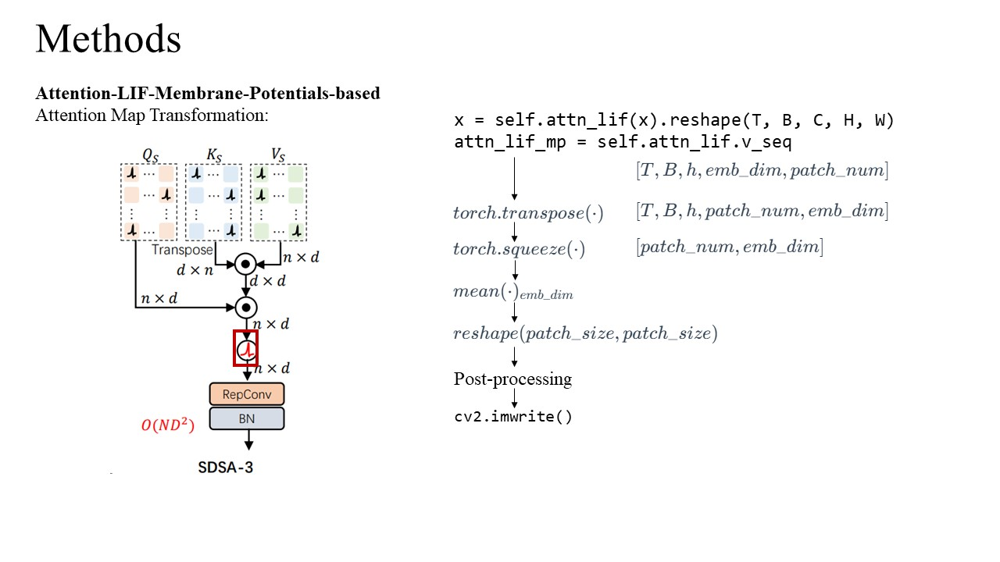
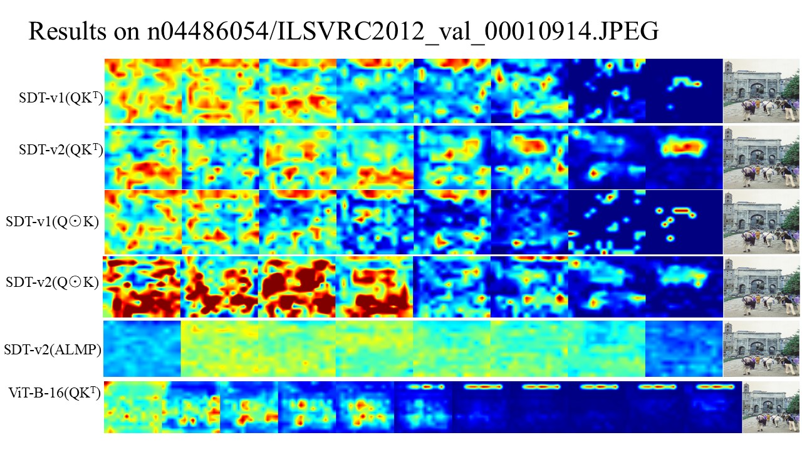
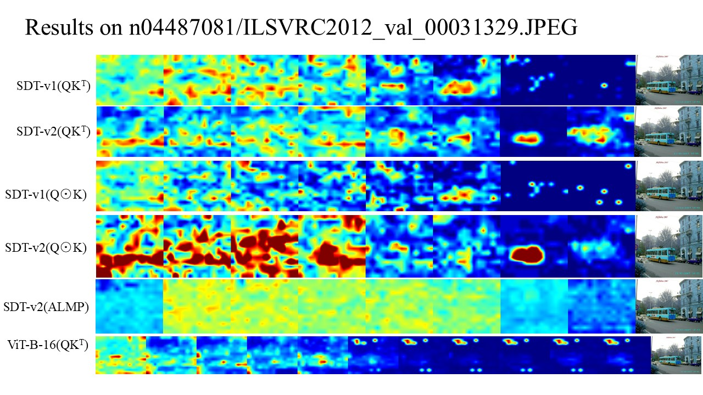
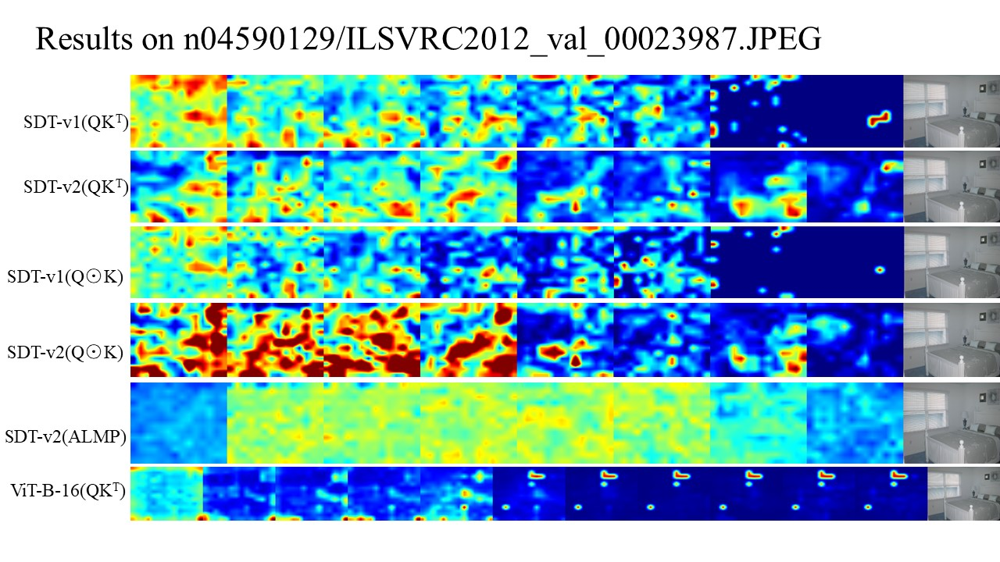
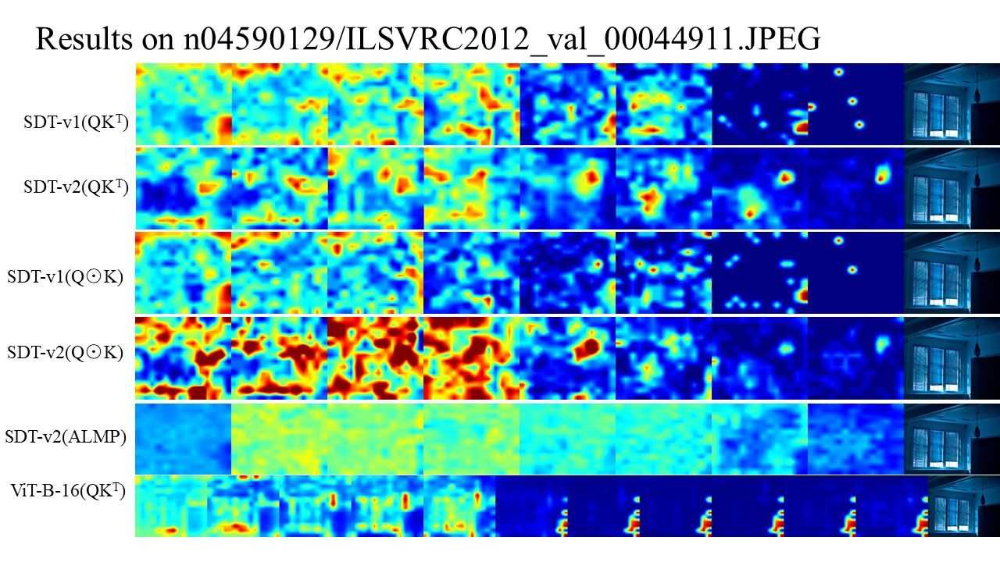
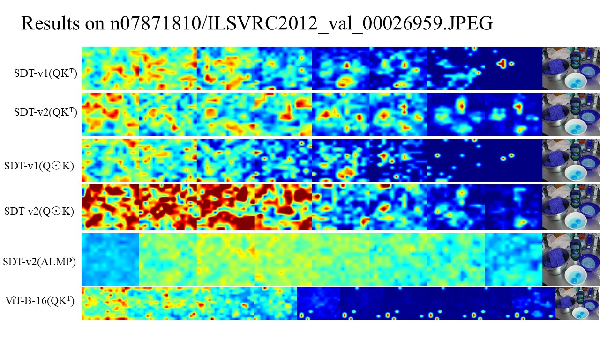

# Vision-Transformer-Visualization

There are two extra folder that need to be downloaded through this link[https://pan.baidu.com/s/1pkuSwBc7T2wR4p5FnZ88jQ?pwd=fpdk].(Cuz they're TOO large to fit in Github)

The whole project content should be like this:
```
|-- vitModelVisualize
    |-- .gitignore
    |-- README.md
    |-- main.py
    |-- requirements.txt
    |-- vis.sh
    |-- attention_data
    |   |-- ViT-B_16-224.npz
    |   |-- ilsvrc2012_wordnet_lemmas.txt
    |-- checkpoint
    |   |-- 55M_kd.pth
    |   |-- 55M_kd_T4.pth
    |   |-- 8_384.pth.tar
    |   |-- imagenet21k+imagenet2012_ViT-B_16.npz
    |   |-- imagenet21k+imagenet2012_ViT-B_32.npz
    |   |-- imagenet21k+imagenet2012_ViT-B_8.npz
    |-- models
    |   |-- __init__.py
    |   |-- configs.py
    |   |-- engine_finetune.py
    |   |-- metaformer.py
    |   |-- modeling.py
    |   |-- modeling_resnet.py
    |   |-- spikeformer.py
    |   |-- v2_models.py
    |   |-- __pycache__
    |       |-- __init__.cpython-311.pyc
    |       |-- configs.cpython-311.pyc
    |       |-- configs.cpython-312.pyc
    |       |-- engine_finetune.cpython-311.pyc
    |       |-- modeling.cpython-311.pyc
    |       |-- modeling.cpython-312.pyc
    |       |-- modeling_resnet.cpython-311.pyc
    |       |-- modeling_resnet.cpython-312.pyc
    |       |-- spikeformer.cpython-311.pyc
    |       |-- v2_models.cpython-311.pyc
    |-- module
    |   |-- __init__.py
    |   |-- ms_conv.py
    |   |-- sps.py
    |   |-- __pycache__
    |       |-- __init__.cpython-311.pyc
    |       |-- __init__.cpython-38.pyc
    |       |-- ms_conv.cpython-311.pyc
    |       |-- ms_conv.cpython-38.pyc
    |       |-- sps.cpython-311.pyc
    |       |-- sps.cpython-38.pyc
    |-- util
    |   |-- crop.py
    |   |-- datasets.py
    |   |-- kd_loss.py
    |   |-- lars.py
    |   |-- lr_decay.py
    |   |-- lr_decay_spikformer.py
    |   |-- lr_sched.py
    |   |-- misc.py
    |   |-- pos_embed.py
    |   |-- __pycache__
    |       |-- datasets.cpython-311.pyc
    |       |-- datasets.cpython-312.pyc
    |       |-- kd_loss.cpython-311.pyc
    |       |-- kd_loss.cpython-312.pyc
    |       |-- lr_decay_spikformer.cpython-311.pyc
    |       |-- lr_decay_spikformer.cpython-312.pyc
    |       |-- lr_sched.cpython-311.pyc
    |       |-- lr_sched.cpython-312.pyc
    |       |-- misc.cpython-311.pyc
    |       |-- misc.cpython-312.pyc
    |-- vis_output
```
## How to Use This Repo?
1. Clone this project and get into the project directory
``` sh
git clone https://github.com/EricZhang1412/Vision-Transformer-Visualization.git
cd Vision-Transformer-Visualization
```
2. Check if you have the appropriate virtual environment using `requiement.txt`

3. There are three models: `sdt-v2_8_512, sdt-v1, vanilla_ViT_b_16` for you to choose. Fill this into `--modelUT "[here]"` in `vis.sh`

4. There are three metrics: `qk, qk_hp, attn_mp` for you to choose. Fill this into `--parameterUT "[here]"` in `vis.sh`

5. Run this shell script
``` sh
sudo chmod +x vis.sh
./vis.sh
```

## Methods




## Some Results






